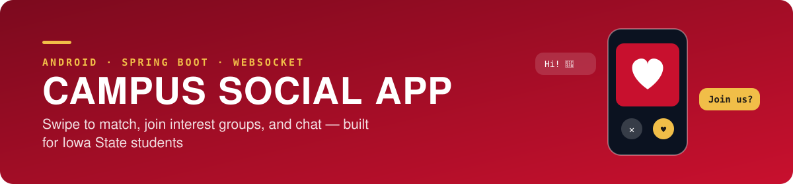
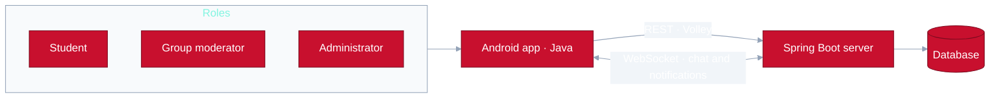

<div align="center">




Iowa State University · COM S 3090 · Team 2_sc_2 · Spring 2026

[Overview](#overview) · [Architecture](#architecture) · [My role](#my-role) · [Results](#results) · [Limitations](#limitations-and-next-steps)

</div>

---

> **Where it stands — Complete**  
> 18 Android activities run against the production server, with system tests and a coverage report.  
> This is the preserved copy of the course GitLab repository, with all branches.

| Activities | My commits | User roles | Team |
| :---: | :---: | :---: | :---: |
| **18** | **107** | **3** | **4** |

| | |
|---|---|
| Period | January – May 2026 (Spring 2026) |
| Team | 4 — Jon Buschko and Brendan Petersen (backend), Haiqa Nasir and Jongwoo Kim (frontend) |
| My role | Android frontend |
| Stack | Java, Android Studio, Volley, WebSocket, Spring Boot, Gradle, Espresso/JUnit, GitLab CI/CD |

Originally hosted on the Iowa State GitLab; this is the preserved copy with all branches.

## Overview

- **Problem:** even on one campus it is hard to find people or clubs that share your interests. The app lets students browse profiles, match, and move into group chats built around hobbies.
- **Three user types:** students (profile, swipe, match, join groups, report), group moderators (approve or remove members, handle reports), and administrators (approve sign-ups, manage reports and accounts).
- **Architecture:** Android app ↔ REST and WebSocket ↔ Spring Boot ↔ database. Backend domains: users, matches, groups, group members, conversations, messages, notifications, reports, user images.

## Architecture



## My role

I worked on the Android frontend (107 commits).

| When | What I built |
|---|---|
| February | Volley request experiments (string, JSON, image), sign-up and delete-account screens, first round trip with the backend |
| March | Group create/read/update/delete and membership management (join requests, approve, ban, moderator toggle), match list with accept/decline/block, WebSocket notification screen |
| April | Interest-based group search and recommendation tabs (main feature 4), real-time notification banner, report system with moderator panel, my frontend CI/CD pipeline, Javadoc |
| May | Admin dashboard and role-based flow (sign up → approval → login), Android system tests and coverage report |

For the group recommendation feature I designed the frontend first, then wrote the API specification the backend needed (`Documents/MainFeature4-api.txt`).

My teammates built the entire Spring Boot backend and the chat, swipe and login screens.

## What I learned

**Technical**
- Android activities and XML layouts, REST calls with Volley, and JSON field mapping.
- Receiving real-time events through a WebSocket listener and manager.
- Espresso system tests, coverage measurement, and a GitLab CI/CD pipeline for the app.
- Developing against a mock server (Mockoon) before the real endpoints existed.

**Teamwork**
- Writing down the API I needed and reconciling field names with the backend (for example `created_at` versus `createdAt`).
- Feature branches, merge requests, resolving conflicts, and reverting a bad merge.
- Agreeing on scope before each demo with screen sketches and a block diagram.

## Resources used

- Course tutorials repository (Android, Volley, WebSocket, Spring Boot examples)
- Android developer documentation
- Mockoon and Postman for API testing

## Results

- 18 activities connected to the production server: login and sign-up, home, swipe, matches, groups, group recommendations, membership management, chat, notifications, reports, moderator panel, admin dashboard.
- Verified the admin approval flow and swipe-triggered notifications end to end.
- Submitted system tests and a frontend coverage report.

## Limitations and next steps

- The server address is written into individual activities, so changing environments meant editing many files. It should live in one configuration value.
- The notification stack was made to work on the frontend side; a matching backend change was still pending at the end of the term.
- Response-time targets from the requirements (0.5 s for UI actions, 2 s for sign-in) were never measured.
- Location-based discovery and group events from the original sketches were not built.

## Diagrams

- [`Documents/block_diagram.pdf`](Documents/block_diagram.pdf) — system block diagram
- [`Documents/2_sc_2_ScreenSketches.pdf`](Documents/2_sc_2_ScreenSketches.pdf) — screen sketches and requirements

## Repository layout

```
Backend/      Spring Boot server
Frontend/     Android app
Documents/    diagrams, sketches, API notes, Javadoc
Experiments/  each member's course experiments
```
